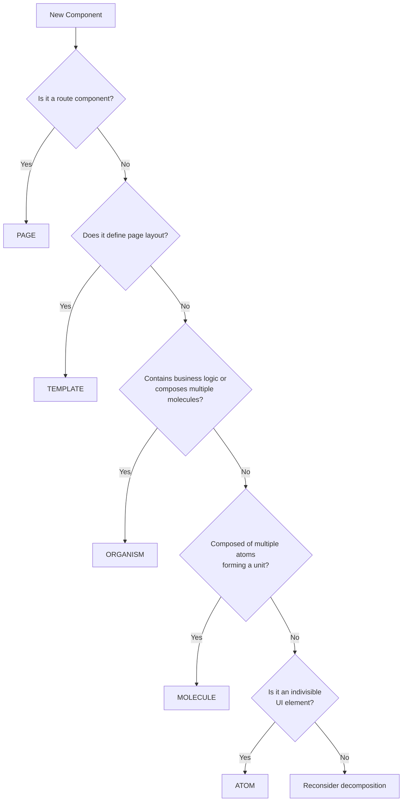

# Atomic Design Guidelines

## Overview

The ATP Store follows Atomic Design methodology to create a consistent, scalable, and maintainable component architecture. This document provides comprehensive guidelines for classifying, organizing, and developing components according to atomic design principles.

## Component Classification Criteria

### Atoms (Indivisible Elements)

**Definition**: Basic building blocks that cannot be broken down further while remaining functional.

**Criteria**:

- Single responsibility (one clear purpose)
- No internal component composition
- Typically < 50 lines of code
- No complex business logic
- Stateless or minimal local state

**Examples**:

- Button, Input, Label, Icon
- EmptyCartButton, LoadingSpinner
- Badge, Avatar, Tooltip

**Location**: `/src/components/ui/` or `/src/components/[feature]/atoms/`

**Implementation Example**:

```typescript
/**
 * Button Atom Component
 * SOLID Principles: SRP - Single responsibility for button interaction
 * Design Patterns: Composite Component Pattern
 */
export function Button({
  variant = 'primary',
  size = 'md',
  children,
  onClick,
  ...props
}: ButtonProps) {
  return (
    <button
      className={cn(buttonVariants({ variant, size }))}
      onClick={onClick}
      {...props}
    >
      {children}
    </button>
  )
}
```

### Molecules (Simple Combinations)

**Definition**: Combinations of atoms that form a single, cohesive unit.

**Criteria**:

- Composed of 2-5 atoms
- Single conceptual unit
- May have simple local state
- Typically 50-150 lines of code
- Reusable across different contexts

**Examples**:

- FormField (Label + Input + Error)
- CartItemCard (Image + Text + Buttons)
- SearchBar (Input + Button + Icon)
- ProductPrice (Price + Discount Badge)

**Location**: `/src/components/[feature]/molecules/`

**Implementation Example**:

```typescript
/**
 * SearchBar Molecule Component
 * SOLID Principles: SRP, OCP - Combines atoms for search functionality
 * Design Patterns: Composite Pattern
 */
export function SearchBar({ onSearch, placeholder }: SearchBarProps) {
  const [query, setQuery] = useState('')

  return (
    <div className="flex gap-2">
      <Input
        value={query}
        onChange={(e) => setQuery(e.target.value)}
        placeholder={placeholder}
      />
      <Button onClick={() => onSearch(query)}>
        <SearchIcon className="h-4 w-4" />
      </Button>
    </div>
  )
}
```

### Organisms (Complex Components)

**Definition**: Complex UI sections composed of molecules and/or atoms.

**Criteria**:

- Composed of multiple molecules/atoms
- Implements business logic
- May connect to stores/APIs
- Typically 150-300 lines of code
- Feature-specific functionality

**Examples**:

- Navbar (Brand + Navigation + Actions)
- ProductGrid (Cards + Filters + Pagination)
- CartItemsList (Multiple CartItemCards + Actions)
- ContactForm (Multiple FormFields + Submit Logic)

**Location**: `/src/components/[feature]/organisms/`

**Implementation Example**:

```typescript
/**
 * ProductGrid Organism Component
 * SOLID Principles: SRP, DIP - Manages product display logic
 * Design Patterns: Container/Presenter Pattern
 */
export function ProductGrid({ products, filters }: ProductGridProps) {
  const [sortBy, setSortBy] = useState('name')
  const [view, setView] = useState<'grid' | 'list'>('grid')

  const sortedProducts = useMemo(() => {
    return [...products].sort((a, b) => {
      // Sorting logic
    })
  }, [products, sortBy])

  return (
    <div>
      <ProductFilters
        onSortChange={setSortBy}
        onViewChange={setView}
      />
      <div className={view === 'grid' ? 'grid' : 'flex flex-col'}>
        {sortedProducts.map(product => (
          <ProductCard key={product.id} product={product} />
        ))}
      </div>
      <Pagination total={products.length} />
    </div>
  )
}
```

### Templates (Page Layouts)

**Definition**: Page-level layouts that define structure without content.

**Criteria**:

- Defines page structure and layout
- Composed of organisms
- No hardcoded content
- Receives data via props
- Handles page-level state

**Examples**:

- CustomerCartTemplate
- AdminDashboardTemplate
- ProductCatalogTemplate

**Location**: `/src/components/[feature]/templates/`

**Implementation Example**:

```typescript
/**
 * CustomerCartTemplate
 * SOLID Principles: SRP, OCP - Defines cart page structure
 * Design Patterns: Template Method Pattern
 */
export function CustomerCartTemplate({
  cart,
  onCheckout,
  onUpdateQuantity
}: CartTemplateProps) {
  return (
    <div className="container mx-auto">
      <CartHeader itemCount={cart.items.length} />
      <div className="grid grid-cols-1 lg:grid-cols-3 gap-8">
        <div className="lg:col-span-2">
          <CartItemsList
            items={cart.items}
            onUpdateQuantity={onUpdateQuantity}
          />
        </div>
        <div>
          <CartSummary summary={cart.summary} />
          <CheckoutButton onClick={onCheckout} />
        </div>
      </div>
    </div>
  )
}
```

### Pages (Route Components)

**Definition**: Specific instances of templates with real content.

**Criteria**:

- Route-specific implementation
- Fetches and provides data
- Server Components when possible
- Minimal UI logic (delegates to template)

**Examples**:

- `/app/cart/page.tsx`
- `/app/products/page.tsx`
- `/app/admin/dashboard/page.tsx`

**Location**: `/src/app/[route]/page.tsx`

**Implementation Example**:

```typescript
/**
 * Cart Page Component
 * Server Component for initial data fetch
 */
export default async function CartPage() {
  const cart = await getServerCart()

  return (
    <CustomerCartTemplate
      cart={cart}
      onCheckout={handleCheckout}
      onUpdateQuantity={handleUpdateQuantity}
    />
  )
}
```

## Decision Tree for Component Classification



## Naming Conventions

### File Naming

- **Atoms**: PascalCase (e.g., `Button.tsx`, `LoadingSpinner.tsx`)
- **Molecules**: PascalCase with descriptive suffix (e.g., `ProductCard.tsx`, `SearchBar.tsx`)
- **Organisms**: PascalCase with context (e.g., `ProductGrid.tsx`, `CheckoutForm.tsx`)
- **Templates**: PascalCase with "Template" suffix (e.g., `CustomerCartTemplate.tsx`)
- **Pages**: lowercase with hyphens (e.g., `page.tsx`, `layout.tsx`)

### Component Naming

- Clear, descriptive names indicating purpose
- Prefix with context when needed (e.g., `AdminSidebar`, `CustomerHeader`)
- Avoid generic names like `Container`, `Wrapper`

### Directory Structure

```
src/components/
├── products/
│   ├── atoms/
│   │   ├── ProductImage.tsx
│   │   ├── ProductPrice.tsx
│   │   └── index.ts
│   ├── molecules/
│   │   ├── ProductCard.tsx
│   │   ├── ProductQuickView.tsx
│   │   └── index.ts
│   ├── organisms/
│   │   ├── ProductGrid.tsx
│   │   ├── ProductFilters.tsx
│   │   └── index.ts
│   ├── templates/
│   │   ├── ProductCatalogTemplate.tsx
│   │   └── index.ts
│   └── index.ts
└── ui/
    └── schadcn/
        ├── button.tsx
        ├── input.tsx
        └── index.ts
```

## Migration Guide for Existing Components

### Step 1: Audit Current Components

```bash
# List all components
find src/components -name "*.tsx" -o -name "*.jsx"

# Count lines of code
wc -l src/components/**/*.tsx
```

### Step 2: Classify Components

1. Review component responsibility
2. Count internal components/atoms used
3. Evaluate state and logic complexity
4. Determine appropriate level using decision tree

### Step 3: Restructure Directory

```bash
# Create atomic structure
mkdir -p src/components/{feature}/atoms
mkdir -p src/components/{feature}/molecules
mkdir -p src/components/{feature}/organisms
mkdir -p src/components/{feature}/templates

# Move components to appropriate directories
mv src/components/ProductCard.tsx src/components/products/molecules/
```

### Step 4: Update Imports

```typescript
// Before
import { ProductCard } from '@/components/ProductCard'

// After
import { ProductCard } from '@/components/products/molecules'
// Or with barrel exports
import { ProductCard } from '@/components/products'
```

### Step 5: Add Barrel Exports

```typescript
// src/components/products/atoms/index.ts
export { ProductImage } from './ProductImage'
export { ProductPrice } from './ProductPrice'

// src/components/products/index.ts
export * from './atoms'
export * from './molecules'
export * from './organisms'
export * from './templates'
```

## Best Practices

### 1. Component Isolation

- Each component should be independently testable
- Minimize external dependencies
- Use dependency injection for services

### 2. Props Design

- Use TypeScript interfaces for all props
- Provide sensible defaults
- Keep props focused and minimal

### 3. State Management

- Atoms: Prefer stateless
- Molecules: Local state only
- Organisms: Can connect to stores
- Templates: Page-level state
- Pages: Data fetching and routing

### 4. Testing Strategy

- Atoms: Unit tests with all variants
- Molecules: Integration of atoms
- Organisms: Mock external dependencies
- Templates: Snapshot testing
- Pages: E2E testing

### 5. Documentation

- Add header comments with SOLID principles
- Document complex logic
- Provide usage examples in Storybook

## Common Pitfalls to Avoid

### ❌ Over-atomization

Breaking components too small loses cohesion

### ❌ Under-atomization

Large monolithic components are hard to maintain

### ❌ Wrong Level Assignment

Placing components at incorrect atomic level

### ❌ Circular Dependencies

Atoms importing from molecules or organisms

### ❌ Inconsistent Naming

Not following established naming conventions

## Validation Checklist

- [ ] Component has single responsibility
- [ ] Appropriate atomic level assigned
- [ ] Follows naming conventions
- [ ] Located in correct directory
- [ ] Has TypeScript interface for props
- [ ] Includes header documentation
- [ ] Barrel exports configured
- [ ] Unit tests written
- [ ] No circular dependencies
- [ ] Follows SOLID principles

## Related Documentation

- [Component Examples](./component-examples.md)
- [Barrel Export Strategy](./barrel-export-strategy.md)
- [Design Patterns](./design-patterns.md)
- [Testing Strategy](./testing-strategy.md)
