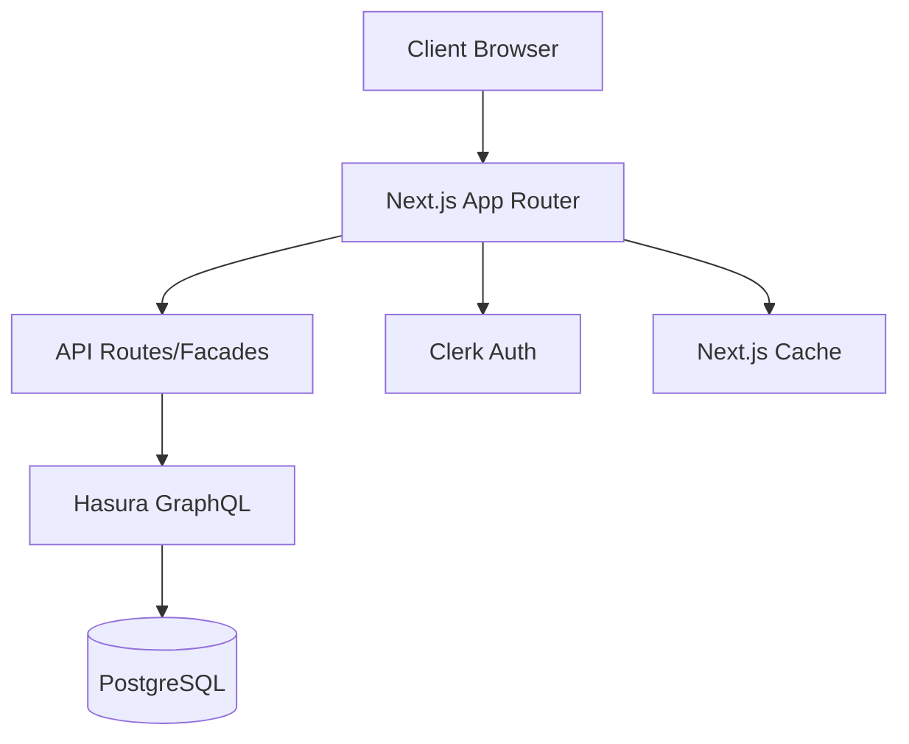

# 🏗️ Architecture Guide - ATP Store

System design, patterns, and architectural decisions.

## 🎯 Architecture Overview



## 🏛️ Core Principles

### SOLID Principles
- **S**ingle Responsibility - Each component has one reason to change
- **O**pen/Closed - Open for extension, closed for modification
- **L**iskov Substitution - Subtypes replaceable without breaking
- **I**nterface Segregation - Many specific interfaces over general
- **D**ependency Inversion - Depend on abstractions, not concretions

### Design Patterns

#### Facade Pattern
```typescript
// API routes act as facades over GraphQL
// /api/products/list → GraphQL query
export async function GET(request: Request) {
  const data = await apolloClient.query({
    query: GET_PRODUCTS,
    variables: parseSearchParams(request.url)
  })
  return NextResponse.json(validateSchema(data))
}
```

#### Singleton Pattern
```typescript
// AuthService singleton
class AuthService {
  private static instance: AuthService
  static getInstance() {
    if (!this.instance) {
      this.instance = new AuthService()
    }
    return this.instance
  }
}
```

#### Observer Pattern
```typescript
// Zustand stores with subscriptions
const useCartStore = create<CartStore>()(
  subscribeWithSelector(
    persist(
      (set, get) => ({
        items: [],
        addItem: (item) => set(state => ({
          items: [...state.items, item]
        }))
      })
    )
  )
)
```

## 📁 Project Structure

```
atp-store-nextjs/
├── src/
│   ├── app/                    # Next.js App Router
│   │   ├── (routes)/           # Public routes
│   │   ├── admin/              # Admin routes
│   │   ├── api/                # API facades
│   │   └── layout.tsx          # Root layout
│   │
│   ├── components/             # React components
│   │   ├── atoms/              # Basic UI elements
│   │   ├── molecules/          # Composite components
│   │   ├── organisms/          # Complex sections
│   │   ├── templates/          # Page layouts
│   │   └── ui/                 # shadcn/ui components
│   │
│   ├── services/               # Business logic
│   │   ├── graphql/           # GraphQL operations
│   │   ├── api/               # API service layer
│   │   └── auth/              # Authentication
│   │
│   ├── stores/                 # Zustand stores
│   │   ├── cart.store.ts
│   │   ├── theme.store.ts
│   │   └── language.store.ts
│   │
│   ├── lib/                    # Utilities
│   │   ├── apollo/            # Apollo Client setup
│   │   ├── styles/            # Style utilities
│   │   └── utils/             # Helper functions
│   │
│   ├── i18n/                   # Internationalization
│   │   ├── locales/           # Translation files
│   │   └── config.ts          # i18n configuration
│   │
│   └── types/                  # TypeScript types
│       ├── generated/         # GraphQL types
│       └── global.d.ts        # Global types
```

## 🔄 Data Flow Architecture

### Server-Side Data Flow
```typescript
1. Server Component requests data
2. Apollo Client (server-side) queries Hasura
3. Hasura validates admin secret
4. Data returned and cached
5. Component renders with data
```

### Client-Side State Flow
```typescript
1. User interaction triggers action
2. Zustand store updates state
3. Persistence middleware saves to localStorage
4. Subscribed components re-render
5. Optional API call for server sync
```

## 🧩 Component Architecture

### Atomic Design Hierarchy

#### Atoms (50+ components)
```typescript
// Smallest, reusable elements
<Button variant="primary" />
<Input type="email" />
<Badge status="active" />
```

#### Molecules (30+ components)
```typescript
// Combinations of atoms
<ProductCard product={data} />
<SearchBar onSearch={handleSearch} />
<PriceDisplay price={100} currency="SEK" />
```

#### Organisms (20+ components)
```typescript
// Complex UI sections
<ProductGrid products={products} />
<CheckoutForm onSubmit={handleCheckout} />
<AdminSidebar navigation={routes} />
```

#### Templates (10+ templates)
```typescript
// Page layouts with slots
<DashboardTemplate>
  <MetricsSection />
  <RecentOrders />
</DashboardTemplate>
```

#### Pages (15+ pages)
```typescript
// Route-specific implementations
export default async function ProductsPage() {
  const products = await getProducts()
  return <ProductsTemplate products={products} />
}
```

## 🔐 Authentication Architecture

### Multi-Layer Security
```typescript
// Layer 1: Middleware protection
middleware.ts → Check auth status

// Layer 2: Layout protection
layout.tsx → Verify user role

// Layer 3: Component protection
AdminOnly wrapper → Role validation

// Layer 4: API protection
API routes → Server-side validation
```

### Role-Based Access Control
```typescript
interface UserRole {
  role: 'admin' | 'customer'
  permissions: Permission[]
  customerId?: string
}

// Permission check
const canAccess = (user: User, resource: Resource) => {
  return user.permissions.includes(resource.permission)
}
```

## 🌐 GraphQL Architecture

### Manual Type Safety Workflow
```typescript
// 1. GraphQL Query
// queries/getProducts.graphql
query GetProducts($limit: Int) {
  products(limit: $limit) {
    id
    name
    price
  }
}

// 2. TypeScript Types
// queries/getProducts.types.ts
export interface GetProductsResponse {
  products: Product[]
}

// 3. Zod Schema
// queries/getProducts.schema.ts
export const ProductSchema = z.object({
  id: z.string(),
  name: z.string(),
  price: z.number()
})

// 4. Validated Mock Data
// mocks/products.mock.ts
export const mockProducts = ProductSchema.array().parse([...])
```

## 🗄️ State Management

### Zustand Store Pattern
```typescript
interface StoreSlice {
  // State
  data: any[]
  loading: boolean
  error: Error | null
  
  // Actions
  fetchData: () => Promise<void>
  updateData: (data: any) => void
  resetStore: () => void
  
  // Computed
  get hasData(): boolean
}
```

### Store Composition
```typescript
// Combine multiple stores
const useStore = create<Store>()(
  devtools(
    persist(
      immer((set, get) => ({
        ...createCartSlice(set, get),
        ...createUserSlice(set, get),
        ...createUISlice(set, get)
      }))
    )
  )
)
```

## 🚀 Performance Optimizations

### Server Components
```typescript
// Default to server components
async function ProductList() {
  const products = await getProducts() // Server-side fetch
  return <ProductGrid products={products} />
}

// Client components only when needed
'use client'
function InteractiveFilter() {
  const [filter, setFilter] = useState()
  // Client-side interactivity
}
```

### Caching Strategy
```typescript
// Next.js caching
export const revalidate = 3600 // 1 hour

// Apollo Client cache
const cache = new InMemoryCache({
  typePolicies: {
    Product: {
      keyFields: ['id'],
      fields: {
        price: {
          merge: false // Always use latest
        }
      }
    }
  }
})
```

### Code Splitting
```typescript
// Dynamic imports
const AdminDashboard = dynamic(
  () => import('@/components/admin/Dashboard'),
  { 
    loading: () => <DashboardSkeleton />,
    ssr: false 
  }
)
```

## 🧪 Testing Architecture

### Test Structure
```typescript
describe('Component', () => {
  // Setup
  beforeEach(() => {
    // Mock dependencies
  })
  
  // Unit tests
  it('should render correctly', () => {})
  it('should handle user interaction', () => {})
  
  // Integration tests
  it('should integrate with store', () => {})
  it('should call API correctly', () => {})
})
```

### Mock Strategy
```typescript
// Mock external dependencies
jest.mock('@clerk/nextjs')
jest.mock('@apollo/client')

// Use validated mock data
import { mockProducts } from '@/mocks'
```

## 🌍 Internationalization

### i18n Architecture
```typescript
// Namespace structure
locales/
├── en/
│   ├── common.json
│   ├── products.json
│   └── admin.json
├── sv/
├── tr/
├── da/
└── de/
```

### Translation Loading
```typescript
// Server-side translation
import { createTranslation } from '@/i18n/server'
const { t } = await createTranslation('products')

// Client-side translation
import { useTranslation } from '@/i18n/client'
const { t } = useTranslation('products')
```

## 📊 Monitoring & Observability

### Error Tracking
```typescript
// Global error boundary
class ErrorBoundary extends React.Component {
  componentDidCatch(error, errorInfo) {
    logErrorToService(error, errorInfo)
  }
}
```

### Performance Monitoring
```typescript
// Web Vitals tracking
export function reportWebVitals(metric) {
  if (metric.label === 'web-vital') {
    sendToAnalytics(metric)
  }
}
```

## 🔒 Security Architecture

### Security Layers
1. **Authentication** - Clerk handles user auth
2. **Authorization** - RBAC for resource access
3. **Validation** - Zod schemas for all inputs
4. **Sanitization** - DOMPurify for user content
5. **Rate Limiting** - API route protection
6. **CSRF Protection** - Built into Next.js

### Environment Security
```typescript
// Server-only secrets
const adminSecret = process.env.HASURA_GRAPHQL_ADMIN_SECRET
// Never exposed to client

// Client-safe variables
const publicUrl = process.env.NEXT_PUBLIC_APP_URL
// Safe for browser
```

## 🚢 Deployment Architecture

### Production Stack
```
Vercel (Hosting) → Next.js App
Hasura Cloud → GraphQL API
Neon → PostgreSQL Database
Clerk → Authentication
SendGrid → Email Service
```

### CI/CD Pipeline
```yaml
1. Push to GitHub
2. Vercel webhook triggered
3. Build & type check
4. Run tests
5. Deploy preview
6. Manual approval
7. Deploy to production
```

## 📈 Scalability Considerations

### Horizontal Scaling
- Stateless architecture
- External session storage
- Database connection pooling
- CDN for static assets

### Vertical Scaling
- Optimized bundle size
- Lazy loading
- Image optimization
- Edge caching

## 🎓 Further Reading

- [Next.js App Router Docs](https://nextjs.org/docs/app)
- [Hasura GraphQL Docs](https://hasura.io/docs)
- [Clerk Authentication Docs](https://clerk.com/docs)
- [Zustand State Management](https://github.com/pmndrs/zustand)